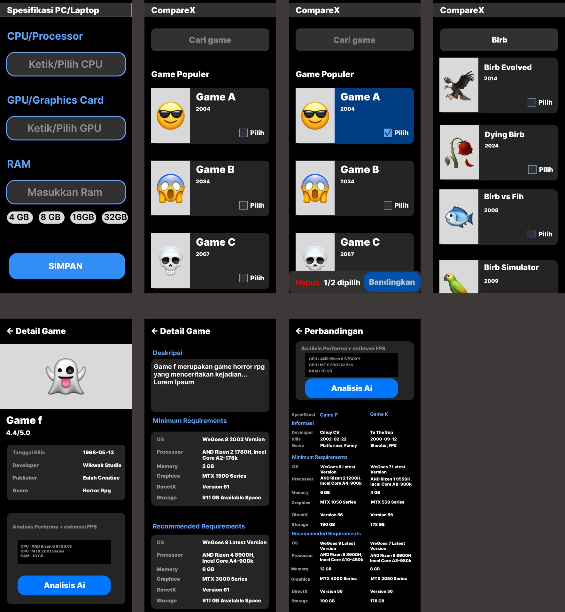

# CompareX — Game Requirements Comparator

> Cek apakah PC/laptop kamu bisa menjalankan game tertentu, lengkap dengan estimasi FPS berbasis analisis AI yang mendalam.

---

## Tentang Aplikasi

CompareX adalah aplikasi Android yang membantu kamu mengetahui seberapa baik hardware PC atau laptop kamu dapat menjalankan sebuah game. Tidak sekadar mencocokkan spesifikasi minimum, CompareX menggunakan AI yang menganalisis arsitektur hardware, engine game, manajemen VRAM, dan referensi benchmark nyata untuk memberikan estimasi FPS yang akurat per area/skenario dalam game.

---

## Fitur Utama

### Analisis Game Tunggal
Input nama game, dan AI akan memberikan:
- Estimasi FPS per preset grafis (Low / Medium / High / Ultra) di 1080p dan 1440p
- Estimasi 1% Low FPS (bukan hanya rata-rata)
- Performa per area/boss spesifik dalam game (bukan generik)
- Rekomendasi setting optimal untuk hardware kamu
- Warning VRAM jika mepet, catatan thermal throttle jika relevan

### Bandingkan Dua Game
Pilih dua game sekaligus dan lihat perbandingan:
- Estimasi FPS masing-masing game di spek yang sama
- Analisis engine per game secara terpisah
- Rekomendasi tegas: game mana yang lebih layak dimainkan di hardware kamu

### Kompatibilitas Hardware
Sebelum AI menganalisis, app sudah menghitung kompatibilitas dasar:
- Status: Kuat (Ultra/High) / Cukup (Medium) / Lemah (Low) / Tidak memenuhi minimum
- Rekomendasi setting grafis awal
- Berdasarkan system requirements dari Steam dan RAWG

### Input Spesifikasi
- Pilih CPU dan GPU dari database 300+ hardware (laptop dan desktop)
- Database mencakup Intel/AMD dari generasi lama hingga terbaru (RTX 50xx, Ryzen AI)
- Input RAM dalam GB
- Data VRAM otomatis terdeteksi dari nama GPU

### Riwayat Analisis
Semua game yang pernah dianalisis tersimpan di history untuk referensi cepat.

---

## Cara Penggunaan

1. **Buka aplikasi** — isi spesifikasi hardware kamu (CPU, GPU, RAM) di halaman setup awal
2. **Cari game** — ketik nama game di kolom pencarian (minimal 2 karakter)
3. **Lihat detail** — tap game untuk melihat info lengkap, system requirements, dan status kompatibilitas
4. **Analisis AI** — tap tombol "Analisis AI" untuk mendapatkan estimasi FPS mendalam
5. **Bandingkan** — centang dua game dari hasil pencarian lalu tap "Bandingkan"

---

## Teknologi

### API yang Digunakan
| API | Fungsi | Keterangan |
|-----|--------|------------|
| RAWG.io | Data game (cover, genre, rating, requirements) | Gratis |
| Steam Store API | System requirements versi terbaru | Gratis |
| DeepSeek AI | Analisis performa & estimasi FPS | Berbayar (key diperlukan) |

### Stack
- **Bahasa:** Java
- **Min SDK:** Android 5.0 (API 21)
- **Target SDK:** Android 14 (API 34)
- **Arsitektur:** MVVM (ViewModel + LiveData)
- **Networking:** Retrofit 2 + OkHttp 3
- **Image loading:** Glide
- **UI:** Material Design 3

### Library Utama
```
androidx.lifecycle:lifecycle-viewmodel:2.7.0
androidx.lifecycle:lifecycle-livedata:2.7.0
com.squareup.retrofit2:retrofit:2.9.0
com.squareup.okhttp3:okhttp:4.12.0
com.github.bumptech.glide:glide:4.16.0
com.google.code.gson:gson:2.10.1
```

---

## Setup & Build

### Prasyarat
- Android Studio Hedgehog atau lebih baru
- JDK 17
- Android SDK API 34

### Langkah Build
```bash
# Clone atau extract project
cd CompareX_v6/CompareX

# Buka di Android Studio, lalu sync Gradle
# Atau build via terminal:
./gradlew assembleDebug
```

### Konfigurasi API Key
Buka `app/src/main/java/com/al/comparex/data/network/ApiClient.java` dan isi:

```java
// RAWG API Key — daftar gratis di https://rawg.io/apidocs
public static final String RAWG_API_KEY = "YOUR_RAWG_KEY_HERE";

// DeepSeek API Key — daftar di https://platform.deepseek.com
// Digunakan untuk analisis AI
```

---

## Cara Kerja AI

AI tidak sekadar melihat angka skor hardware. Proses analisisnya:

1. **Identifikasi arsitektur** — dari nama GPU/CPU, AI mengenali generasi, TDP, VRAM, dan performa setara di desktop
2. **Analisis engine game** — setiap game punya karakteristik berbeda (RE Engine sangat dioptimasi, UE5 Lumen berat, Java engine butuh RAM besar)
3. **Referensi benchmark nyata** — AI mengacu pada data benchmark dari Digital Foundry, TechPowerUp, komunitas Reddit/Steam
4. **Faktor kondisional** — thermal throttle dan VRAM warning hanya disebut jika memang relevan untuk kombinasi hardware-game tersebut
5. **Estimasi FPS akurat** — range maksimal 10 FPS (contoh: 55-65, bukan 40-70), selalu disertai 1% Low FPS

---

## Database Hardware

Mencakup 300+ CPU dan GPU, dikelompokkan:

**CPU Laptop:** Intel Core i3/i5/i7/i9 (gen 10-14), Intel Core Ultra, AMD Ryzen 3/5/7/9 (3000-8000 series), AMD Ryzen AI

**CPU Desktop:** Intel Core i3/i5/i7/i9 (gen 6-14), Intel Core Ultra, AMD Ryzen 3/5/7/9 (1000-9000 series)

**GPU Laptop:** NVIDIA GTX 10xx/16xx, RTX 20xx/30xx/40xx/50xx Laptop, AMD RX 5000M-7900M, Intel Arc Laptop, semua iGPU AMD/Intel

**GPU Desktop:** NVIDIA GTX 600-1080 Ti, RTX 2000-5000 series, AMD RX 400-9000 series, Intel Arc

---

## Struktur Project

```
app/src/main/java/com/al/comparex/
├── data/
│   ├── model/          # SpekUser, GameDetail, CompatibilityResult, dll
│   ├── network/        # ApiClient, RawgApi, SteamApi, GeminiApi
│   └── repository/     # GameRepository
├── ui/
│   ├── main/           # MainActivity, GameAdapter, HistoryAdapter
│   ├── detail/         # GameDetailActivity + ViewModel
│   ├── compare/        # CompareActivity + ViewModel
│   ├── spek/           # SpekInputActivity
│   └── splash/         # SplashActivity
└── utils/
    ├── AiAnalysisBuilder.java      # System prompt & user prompt builder
    ├── CompatibilityCalculator.java # Kalkulasi kompatibilitas hardware vs req
    ├── HardwareData.java           # Database CPU/GPU + dynamic score calc
    ├── FuzzySearchAdapter.java     # Fuzzy search untuk dropdown hardware
    ├── HistoryPrefs.java           # Penyimpanan riwayat analisis
    └── SpekPrefs.java              # Penyimpanan spesifikasi user
```

---

## Catatan

- Estimasi FPS bersifat prediktif berdasarkan analisis AI — hasil nyata bisa berbeda tergantung driver, versi game, dan kondisi spesifik laptop
- VRAM RTX 3060 Laptop (6GB) berbeda dengan RTX 3060 Desktop (12GB) — app sudah menangani perbedaan ini
- Untuk laptop gaming, performa bisa bervariasi tergantung mode power (Silent / Balanced / Performance)

---

## Tampilan UI apk



Figma: https://www.figma.com/design/21gM673Y5HheM7mnMdJbrT/CompareX?node-id=189-25&t=lQoI2PJLLABON9jT-1

Clickup: https://sharing.clickup.com/90181768473/l/h/4-901810084256-1/a360d98cfcc51c8
